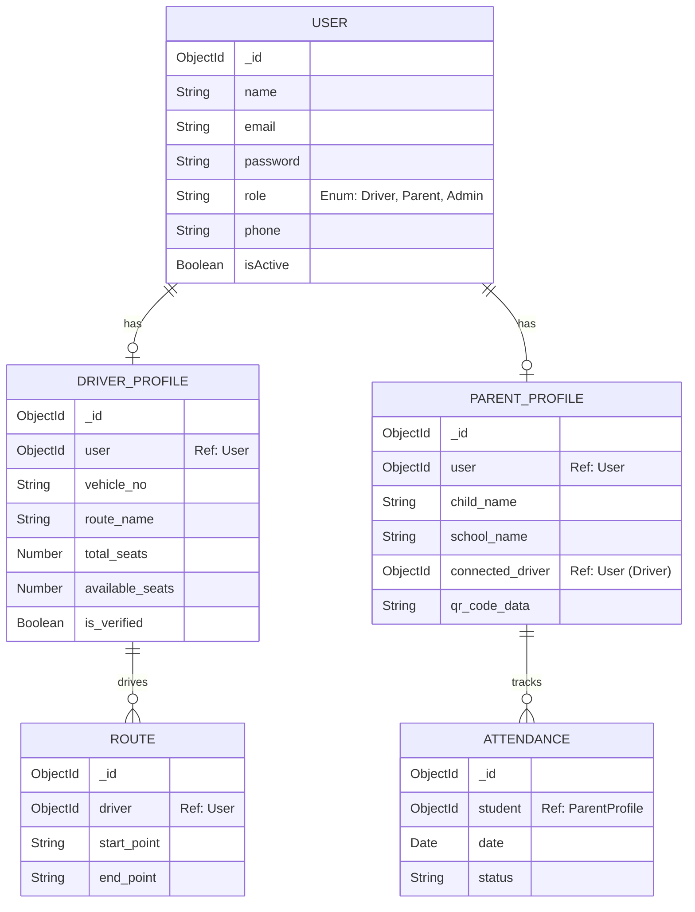

# School Saathi — Comprehensive School Transport Management Platform

A production-inspired comprehensive solution for school transport management, featuring a robust Flutter mobile application for Parents and Drivers, a full-stack Node.js backend, and a dedicated React administrative workspace.

## Standout Engineering Features
- **Real-time Location Tracking**: WebSocket-powered live location sharing for school vehicles.
- **Dedicated Administrative Dashboard**: React-based dashboard for analytics and lifecycle management of users.
- **Secure QR Code Attendance**: Integrated QR scanning mechanism for student boarding and alighting.
- **Role-based Multi-application Architecture**: Separate experiences for Parents, Drivers, and Admins.
- **Automated Notifications**: Real-time push notifications for vehicle arrival, boarding, and dropping using Firebase (FCM).
- **Payment Integration**: Razorpay-integrated fee settlement flow.

## Live Demo, Repository & APK
| Resource | Link |
| --- | --- |
| **Android APK** | [Download App (app-debug.apk)](./build/app/outputs/flutter-apk/app-debug.apk) |
| **Admin Dashboard** | Localhost Setup Required |
| **Backend API** | Localhost Setup Required |

## Detailed Engineering Documentation
| Component | Description |
| --- | --- |
| `backend/` | Node.js backend architecture, MongoDB workflows, Authentication, Razorpay integration, Socket.io for live tracking, and API internals. |
| `lib/` | Flutter app architecture, Provider state management, real-time map integration, QR code scanner, and UI system. |
| `admin-panel/` | React dashboard architecture, user lifecycle management, analytics workflows, and operational interfaces. |

## Schema Diagram (MongoDB)



## Table of Contents
- [Project Overview](#project-overview)
- [Tech Stack](#tech-stack)
- [Architecture](#architecture)
- [Key Features](#key-features)
- [API Reference](#api-reference)
- [Getting Started](#getting-started)
- [Environment Variables](#environment-variables)

## Project Overview
School Saathi is a cross-platform multi-role transport management platform built from scratch using MongoDB, Express, React/Flutter, and Node.js. The system supports three independent applications sharing a centralized backend API:

| Application | Technology | Purpose |
| --- | --- | --- |
| `backend/` | Node.js + Express + MongoDB | REST API + WebSockets for tracking |
| `lib/` (App) | Flutter + Provider | Customer-facing app for Parents & Drivers |
| `admin-panel/` | React + Vite + Tailwind | Administrative workspace |

## Tech Stack
**Backend**
- **Runtime**: Node.js
- **Database**: MongoDB (Mongoose ORM)
- **Authentication**: JWT + bcrypt
- **Real-time**: Socket.io
- **Push Notifications**: Firebase Admin (FCM)
- **Payments**: Razorpay
- **Storage**: Cloudinary

**Frontend (Mobile App)**
- **Framework**: Flutter
- **State Management**: Provider
- **Maps**: flutter_map / Geolocator
- **QR**: qr_flutter / mobile_scanner

**Admin Dashboard**
- **Framework**: React 19 + Vite
- **Styling**: Tailwind CSS
- **Routing**: React Router v7

## Architecture
```text
school_sathi/
├── backend/
│   ├── config/
│   ├── controllers/
│   ├── middleware/
│   ├── models/
│   ├── routes/
│   └── socket/
├── lib/ (Flutter)
│   ├── features/
│   ├── models/
│   ├── providers/
│   ├── services/
│   └── utils/
└── admin-panel/
    ├── src/
    │   ├── components/
    │   ├── pages/
    │   └── api.js
```

### System Flow
```text
Flutter App (Parent/Driver) / React Admin
        ↓
Provider / Context State
        ↓
HTTP REST / WebSockets Layer
        ↓
Express REST API & Socket.io Server
        ↓
MongoDB Database
```

## Key Features

**Parent App**
- Track child's school vehicle in real-time on a map.
- Receive instant push notifications for boarding and dropping.
- Unique QR code generation for secure child handoff.
- Pay transport fees seamlessly using Razorpay.

**Driver App**
- Share live location securely with connected parents.
- Scan QR codes to mark attendance (boarding/dropping).
- Manage seats and route details.
- View connected parents and emergency contact details.

**Admin Dashboard**
- Secure administrative access to monitor system.
- Approve or reject Driver verification requests.
- View platform analytics and manage user lifecycles.

## API Reference

**Authentication**
- `POST /api/auth/register` - Register user
- `POST /api/auth/login` - Login user

**Profiles**
- `GET /api/profile/me` - Get current user profile
- `PUT /api/profile/update` - Update profile

**Tracking (WebSockets)**
- `Event: location_update` - Driver emits location
- `Event: subscribe_location` - Parent listens to driver's location

**Attendance**
- `POST /api/attendance/mark` - Driver scans QR to mark attendance

## Getting Started

### Prerequisites
- Node.js 18+
- MongoDB instance (Atlas or local)
- Flutter SDK 3.8+
- Firebase Project (for FCM)
- Razorpay Account

### Installation

```bash
git clone https://github.com/goudaritesh/school-saathi.git
cd school-saathi

# Backend Setup
cd backend && npm install
npm start

# Admin Panel Setup
cd ../admin-panel && npm install
npm run dev

# Flutter App Setup
cd ..
flutter pub get
flutter run
```

## Environment Variables

**Backend (`backend/.env`)**
```env
PORT=5000
MONGO_URI=your_mongodb_uri
JWT_SECRET=your_jwt_secret
CLOUDINARY_CLOUD_NAME=your_cloud_name
CLOUDINARY_API_KEY=your_api_key
CLOUDINARY_API_SECRET=your_api_secret
RAZORPAY_KEY_ID=your_razorpay_key
RAZORPAY_KEY_SECRET=your_razorpay_secret
FIREBASE_SERVER_KEY=your_firebase_key
```

**Flutter App (`.env`)**
```env
API_URL=http://your_backend_ip:5000
RAZORPAY_KEY_ID=your_razorpay_key
```
